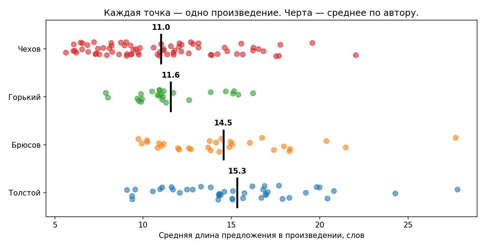

# Краткость — сестра таланта?

«Краткость — сестра таланта» — фраза самого Чехова из письма брату Александру.
Проверяем, следовал ли он ей: **короче ли у него предложения, чем у других?**

Учебный проект по количественной стилистике. Русская проза в общественном
достоянии, 170 произведений, около 190 тысяч предложений.

| | Произведений | Средняя длина предложения | Медиана |
|---|---|---|---|
| **Чехов** | 73 | **11,0** слова | 10,8 |
| **Горький** | 25 | **11,6** слова | 11,0 |
| **Брюсов** | 30 | **14,5** слова | 14,0 |
| **Толстой** | 42 | **15,3** слова | 15,0 |



Чехов действительно самый краткий из четырёх. Но выводы делаем осторожно:
распределения широко пересекаются — у Чехова есть тексты длиннее среднего
Толстого, у Толстого короче среднего Чехова. Это утверждение про средние,
а не про каждый текст.

## Данные

[RusLit](https://github.com/d0rj/RusLit) — русская классика в `.txt` (UTF-8),
всё в общественном достоянии. Тексты в репозиторий **не входят**: это чужой
датасет, он уже опубликован. Скачиваются одной командой (см. ниже).

Описание данных и правил отбора — в [`data/DATA.md`](data/DATA.md).

## Метод

- Границы предложений размечает [razdel](https://github.com/natasha/razdel) —
  часть набора [Natasha](https://natasha.github.io/) для русского NLP. Делить
  текст по точке нельзя: разбиение ломается на сокращениях («и т. д.») и инициалах.
- **Считаем по произведениям, а не по предложениям.** Средняя длина считается
  внутри каждого текста, потом усредняется по текстам. Иначе «Война и мир»
  (треть всех предложений Толстого в датасете) перевесила бы всё остальное.
- **Только повествовательная проза.** Исключены пьесы, а также публицистика,
  очерки и поэма в прозе у Горького. Поимённый список — в `data/DATA.md`.
- Тексты короче 50 предложений исключены — среднее по ним было бы шумом.

## Как запустить

```bash
git clone https://github.com/shushennn/chekhov-brevity.git
cd chekhov-brevity

git clone --depth 1 https://github.com/d0rj/RusLit.git data/raw

python3 -m venv .venv
source .venv/bin/activate
pip install -r requirements.txt
```

Дальше откройте `analysis.ipynb` и запустите все ячейки — в VS Code или командой
`jupyter notebook`. Занимает около двух минут, почти всё время — разбиение
на предложения.

## Структура

```
chekhov-brevity/
├── README.md
├── requirements.txt
├── .gitignore
├── analysis.ipynb         сам анализ
├── data/
│   ├── DATA.md            описание данных
│   ├── raw/               корпус RusLit (в репозиторий не входит)
│   └── processed/
│       └── works.csv      одна строка — одно произведение
└── figures/
    └── sentence_length.png
```

## Ограничения

- **Диалог не отделён от повествования.** У Чехова много прямой речи, реплики
  коротки по определению. Часть разницы может объясняться долей диалога, а не
  стилем как таковым.
- **Жанры разные.** У Чехова в основном рассказы, у Толстого — романы и повести.
- **Выборка Чехова смещена к раннему периоду:** медианный год его текстов
  в датасете — 1886, то есть в основном юморески для журналов.
- **Тексты не выверены** по академическим изданиям.
- **Выборка неполная** и сформирована не нами.

## Что дальше

- [ ] Динамика по годам (в `info.csv` датасета есть год написания)
- [ ] Отделить прямую речь от авторского повествования
- [ ] Добавить Достоевского, Тургенева, Гоголя — тот же корпус, тот же код
